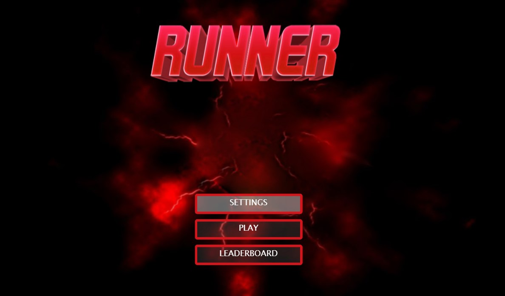
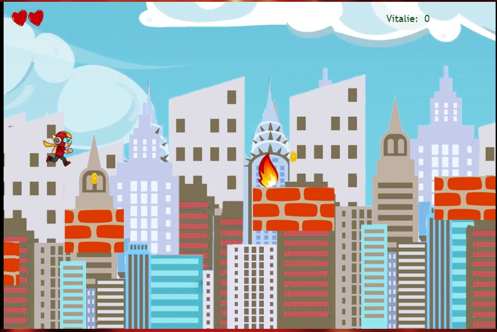
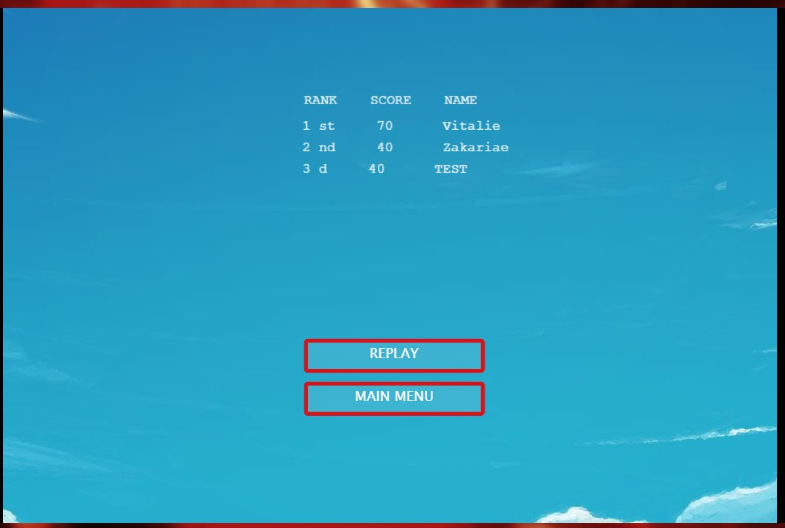

# The The Runner

A JavaScript project built using the Phaser 3 Game Engine
 
<a href=""><strong>Explore the docs </strong></a>
 
 

<a href="https://github.com/vmwhoami/TheRunner/issues">Report Bugs</a>

<a href="https://github.com/vmwhoami/TheRunner/issues">Request Additional Feature</a>

  

## Table of Contents

- [Table of Contents](#table-of-contents)
- [Project Description](#project-description)
- [How to Play](#How-to-Play)

- [Design](#Design)
- [Built With](#Built-With)
- [Live Demo](#Live-Demo)
- [Using this project](#Using-this-project)
  - [Installing Dependencies](#Installing-Dependencies)
  - [Running The Project](#Running-The-Project)
  - [Testing](#Testing)
- [NPM available scripts](#NPM-available-scripts)

- [Future Work](#Future-Work)
- [Author](#Author)
- [License](#license)
- [Acknowledgments](#Acknowledgments)

## Project description.

> JavaScript Curriculum Final Project @Microverse

Implementation of an Adventure Game built with the [Phaser 3](https://phaser.io/phaser3) framework.

In this project, I utilize the Phaser 3 framework to build an endless runner game. It is a game in which you need to survive without falling off the platforms while also skipping fire. The player acquires points by collecting coins.
I used Adobe Photoshop and TexturePacker to create the character and the background.
I used local storage to persist in the player score.
I also used the Leaderboard API to post the player's score, displaying the top 10 players on the leaderboard scene.

### How to Play

You need to jump from one platform to another. To jump, either press space, or click with the left button in your mouse. Your score increases with every coin picked which is worth 10 points.

## Design

This game was designed using Phaser 3.

The rules of the game are: You need to jump from one platform to another. If you hit miss a platform or you touch the fire you die. You have 3 attempts as in 3 lives. When your live count goes to 0 the game is over. Your score increases with every coin picked which is worth 10 points.

The purpose of the game is to gain the max score count by picking coins.

Once you lose in the game you get a chance to see the leaderboard and watch how well you rank against another player:

To jump, either press space, or click with the left button in your mouse. Have fun!!!

## Built With

- HTML5/CSS
- Phaser 3
- Webpack
- Javascript
- Eslint
- Babel
- Stylelint
- npm
- Jest for testing
- [Netlify](https://www.netlify.com/) for deployment
- [Leaderboard API service](https://www.notion.so/Leaderboard-API-service-24c0c3c116974ac49488d4eb0267ade3) for high scores

## Live Demo

[Play Game on Live Link](https://therunner.netlify.app/)

## Using This Project

1. Make a directory somewhere in your file system where you want to keep your project.
2. `cd` into that directory from the command line.
3. Clone this project with `git clone https://github.com/vmwhoami/TheRunner`.
4. `cd` to TheRunner

### Installing Dependencies

1. From the cloned project's directory, run `npm install`.

### Running The Project

- Clone the project to your local machine;
- `cd` into the project directory;
- Run `npm install` to install the necessary modules;
- To check in development mode, run `npm start`, the page will automatically load on [localhost:3000](localhost:3000).

### Testing

Jest, a JavaScript testing framework was used for testing to ensure correctness of any JavaScript codebase.
To run the test use: `npm test`

## Building The Project

To host the project on external server like netlify, you will need to run the webpack build command:
`npm run build`

## NPM available scripts:

Use "npm run-script " followed by any of the following commands :

- `"build": "webpack --mode production`
- `"watch": "webpack --mode development --watch"`
- `"test": "jest"`

## Future Work

- Add other enemies besides fire
- Make a levels
- Add another level with another background

## Author

**Vitalie Melnic**

- Github: [@vmwhoami](https://github.com/vmwhoami/)
- Twitter: [@vmwhoami](https://twitter.com/vmwhoami)
- Linkedin: [vitalie-melnic](https://www.linkedin.com/in/vitalie-melnic/)

## License

Distributed under the MIT License. See `LICENSE` for more information.

## 🤝 Contributing

Contributions, issues and feature requests are welcome!

Feel free to check the [issues page](https://github.com/vmwhoami/TheRunner/issues).

## Show your support

Give a ⭐️ if you like this project!

## Acknowledgments

- [Microverse](https://www.microverse.org/)
- [Phaser](https://phaser.io/)
- [Code Academy](https://www.codecademy.com/learn/learn-phaser)
